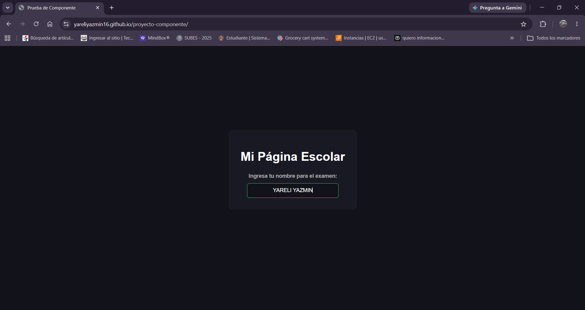
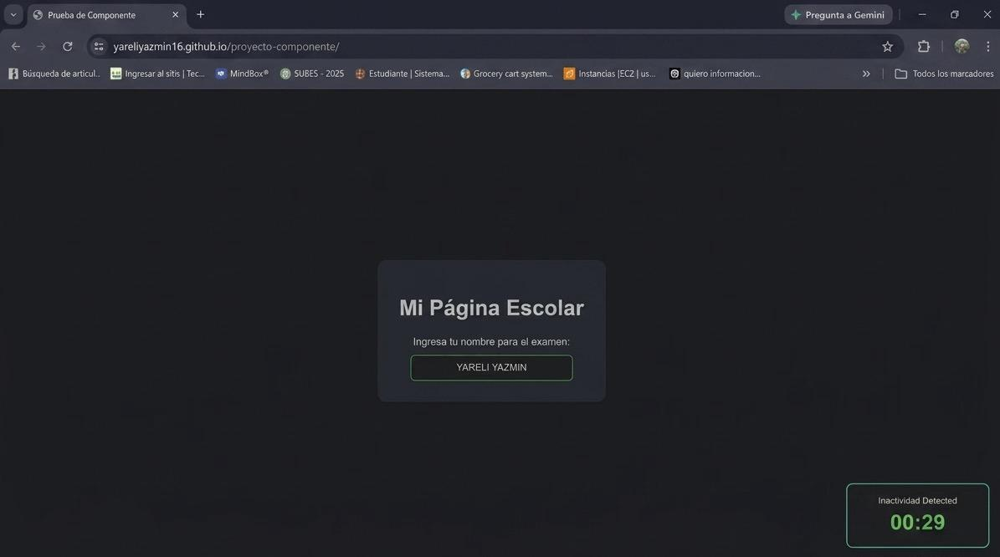
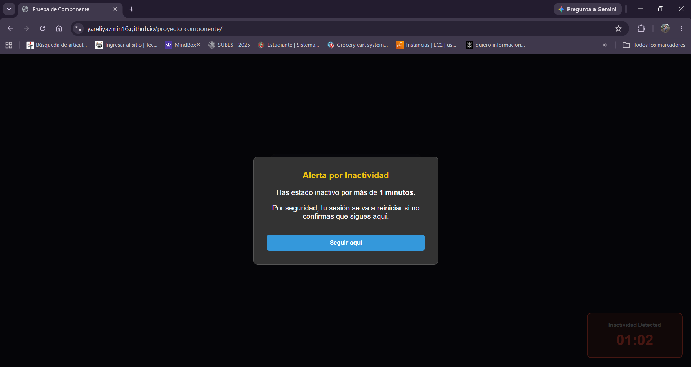
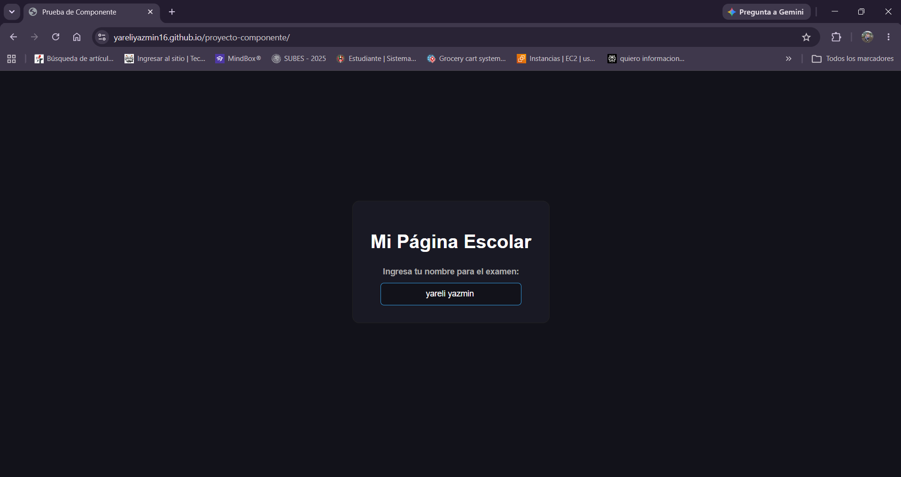

# Actividad: Librería de Componentes Visuales - Sensor de Inactividad con Ventana de Aviso

### **Información del Estudiante**
* **Instituto:** Instituto Tecnológico de Oaxaca
* **Carrera:** Ingeniería en Sistemas Computacionales
* **Nombre de la Alumna:** Yareli Yazmin Pacheco Aragón
* **Grupo:** 7SC
* **Materia:** Programación Web

---

## 1. Nombre de mi Componente y Qué Problema Resuelve

### **Nombre:** Sensor de Inactividad Automático con Ventana de Aviso (Modal)

Este proyecto es un componente visual interactivo y reutilizable diseñado para **monitorear en tiempo real el tiempo de inactividad de un usuario dentro de cualquier página web**.

A diferencia de las funciones simples que solo procesan datos de manera oculta, este componente trabaja directamente en el DOM mediante escuchadores de eventos. Mientras el usuario está interactuando activamente con la página, el componente permanece oculto y el contador se mantiene en ceros de forma automática.

Si el usuario deja la computadora sola por más de 5 segundos, el panel se vuelve visible en la esquina seleccionada y comienza a contar el tiempo. Al cumplirse el tiempo límite configurado por el desarrollador, el componente cambia a color rojo y bloquea la pantalla con una ventana que le avisa que su sesión está en riesgo. Si el aviso no es respondido en 10 segundos, la página se reinicia automáticamente para proteger la información.

Esto resuelve problemas críticos en la vida real, por ejemplo:
* **Banca en línea:** Cerrar de forma segura una sesión bancaria si el usuario dejó su computadora desatendida en un lugar público.
* **Plataformas de comercio:** Liberar productos reservados en un carrito de compras si el cliente abandona el proceso.
* **Seguridad de datos:** Prevenir accesos no autorizados en plataformas corporativas o escolares por inactividad.

---

## 2. Cómo están organizados los archivos (Estructura)
```
proyecto-componente/
├── css/
│   ├── componente.css   # Solo los estilos del cronómetro y de la ventana de aviso
│   └── pagina.css       # Los estilos normales de fondo y cajas del ejemplo
├── js/
│   └── componente.js    # Lógica del sensor, contador y eventos de inactividad
└── index.html           # Página principal de simulación que consume la librería

```

---

## 3. Instalación (Cómo implementarlo a un proyecto HTML)

Para integrar este componente en cualquier página web, solo se deben incluir las siguientes llamadas dentro del archivo HTML:

1. Agregar los estilos de la librería dentro del `<head>`:

```html
<link rel="stylesheet" href="css/componente.css">

```

2. Agregar el archivo de lógica en JavaScript justo antes del cierre del `</body>`:

```html
<script src="js/componente.js"></script>

```

---

## 4. Uso y Ejemplos de Código Real

* El componente es completamente reutilizable y paramétrico. Al inicializarlo desde el script, se configuran dos variables clave: la ubicación espacial del panel y el límite de tolerancia de inactividad expresado en minutos.

```javascript
// Estructura: iniciarCronometro('esquina', minutos);
iniciarCronometro('bottom-right', 5);

```

### Ejemplo 1: Implementación en una Tienda Online (Arriba a la derecha a los 15 minutos)

```html
<!DOCTYPE html>
<html lang="es">
<head>
    <meta charset="UTF-8">
    <title>Tienda de Ropa - Mi Carrito</title>
    <link rel="stylesheet" href="css/pagina.css">
    <link rel="stylesheet" href="css/componente.css">
</head>
<body>

    <div class="container">
        <h1>Tu Carrito de Compras</h1>
        <p>Por favor, completa tu pago. Tus artículos están reservados temporalmente.</p>
    </div>

    <script src="js/componente.js"></script>
    <script>
        // Monitorea inactividad y despliega el aviso a los 15 minutos arriba a la derecha
        iniciarCronometro('top-right', 15);
    </script>
</body>
</html>

```

### Ejemplo 2: Implementación en una Banca Electrónica (Abajo a la izquierda a los 3 minutos)

```html
<!DOCTYPE html>
<html lang="es">
<head>
    <meta charset="UTF-8">
    <title>Mi Banco Seguro</title>
    <link rel="stylesheet" href="css/pagina.css">
    <link rel="stylesheet" href="css/componente.css">
</head>
<body>

    <div class="container">
        <h1>Banca en Línea</h1>
        <p>Mantenemos un entorno seguro monitoreando tu sesión.</p>
    </div>

    <script src="js/componente.js"></script>
    <script>
        // Alerta de seguridad rápida a los 3 minutos de inactividad abajo a la izquierda
        iniciarCronometro('bottom-left', 3);
    </script>
</body>
</html>

```

---

## 5. Capturas de Pantalla de mi Proyecto

* **Estado de Espera (Usuario Activo):**

* Mientras el usuario mueva el mouse, dé clics o presione teclas, el componente se mantiene invisible y en ceros. No interfiere visualmente con el flujo de la aplicación.
* **Detección de Inactividad (Panel Activo):**

* Si la pantalla se deja sola por más de 5 segundos, el panel se vuelve visible automáticamente en la esquina configurada y empieza a contar el tiempo acumulado de inactividad en color verde
* **Reinicio Dinámico:**
* Si el usuario regresa a la computadora y realiza cualquier movimiento antes del límite, el panel desaparece de inmediato de la interfaz y el temporizador vuelve a 00:00 de forma reactiva.
* **Límite Excedido y Bloqueo de Seguridad:**

* Al cumplirse los minutos indicados por parámetro, el reloj cambia a rojo y se activa la ventana con el mensaje de aviso,  inhabilitando la navegación.

* Si no se presiona "Seguir aquí" en un lapso de 10 segundos, la página web se refrescará de forma automática.
* Pero si presionas "Seguir aquí" te regresa a la página como la dejaste 


---


## 6. Video Demostrativo 
https://drive.google.com/file/d/1c6M5UHCB21FywquOmYZNiMRmW7Ojk9Mn/view?usp=sharing 

